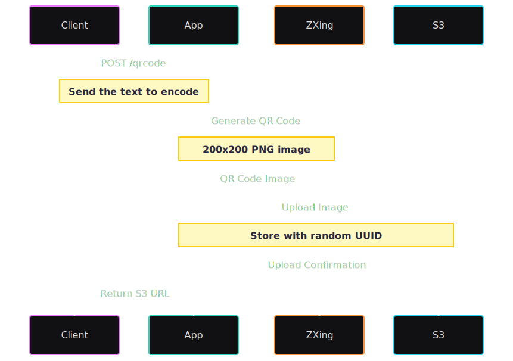

<h1 align="center">
Gerador de QR Code
</h1>


<p align="center">
 


  
  


</p>

<br>



<p align="center">
Aplicação Spring Boot que gera QR Codes e os armazena no AWS S3. Este projeto demonstra a integração da biblioteca ZXing do Google para geração de QR Codes e do AWS S3 para armazenamento.
</p>

## Uso

Esta seção fornece instruções para configurar e executar a aplicação de geração de QR Codes.

### Pré-requisitos

- JDK Java 21
- Maven
- Docker
- Conta AWS com acesso ao S3
- AWS CLI configurado com credenciais apropriadas

### Variáveis de Ambiente

Crie um arquivo `.env` na raiz do projeto com as seguintes variáveis:

```env
AWS_ACCESS_KEY_ID=sua_access_key
AWS_SECRET_ACCESS_KEY=sua_secret_key
AWS_REGION=sua_regiao
AWS_BUCKET_NAME=nome_do_seu_bucket
```

### Executando a Aplicação

#### Desenvolvimento Local

1. Crie o arquivo `.env` conforme descrito acima
2. Compile o projeto:
   ```bash
   mvn clean package
   ```
3. Execute a aplicação:
   ```bash
   mvn spring-boot:run
   ```

#### Execução com Docker

1. Construa a imagem Docker:
   ```bash
   docker build -t qrcode-generator:X.X . 
   ```


2. Execute o container:
   ```bash
   docker run --env-file .env -p 8080:8080 qrcode-generator:X.X 
   ```

### Configuração do AWS S3

1. Crie um bucket S3 na sua conta AWS
2. Atualize o `AWS_BUCKET_NAME` no arquivo `.env` ou no comando Docker
3. Garanta que suas credenciais AWS possuem permissões adequadas para acessar o bucket S3


## Endpoints da API

### POST /qrcode

Gera um QR Code a partir do texto fornecido e o armazena no AWS S3. O QR Code será gerado como uma imagem PNG com dimensões de 200x200 pixels.

**Parâmetros**

| Nome | Obrigatório | Tipo | Descrição |
|------|-------------|------|-----------|
| `text` | obrigatório | string | Conteúdo de texto que será codificado no QR Code. Pode ser qualquer valor de string que você deseja converter em QR Code. |

**Resposta**

```json
{
    "url": "https://seu-bucket.s3.sua-regiao.amazonaws.com/uuid-aleatorio"
}
```

**Resposta de Erro**

Caso ocorra algum erro durante a geração do QR Code ou upload para o S3, a API retornará um erro 500 (Internal Server Error).

**Exemplo de Uso**

```bash
curl -X POST http://localhost:8080/qrcode 
     -H "Content-Type: application/json" 
     -d '{"text": "https://example.com"}'
```